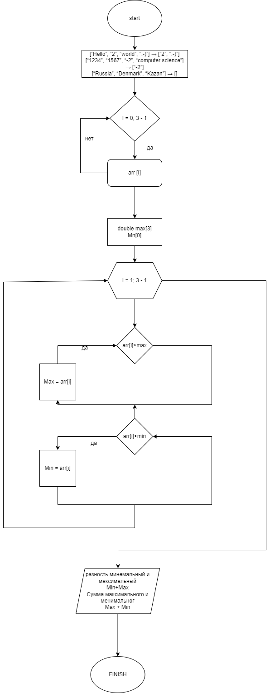

# Код для выведение масива 
using System;

class Program
{
    static string[] FilterStrings(string[] arr)
    {
        int count = 0;
        // Подсчет количества строк, удовлетворяющих условию
        for (int i = 0; i < arr.Length; i++)
        {
            if (arr[i].Length <= 3)
            {
                count++;
            }
        }

        // Создание нового массива нужного размера и добавление подходящих строк
        string[] result = new string[count];
        int index = 0;
        for (int i = 0; i < arr.Length; i++)
        {
            if (arr[i].Length <= 3)
            {
                result[index] = arr[i];
                index++;
            }
        }

        return result;
    }

    static void Main(string[] args)
    {
        // Примеры массивов
        string[][] arrays = new string[][]
        {
            new string[] {"Hello", "2", "world", ":-)"},
            new string[] {"1234", "1567", "-2", "computer science"},
            new string[] {"Russia", "Denmark", "Kazan"}
        };

        // Фильтрация и вывод результатов для каждого массива
        foreach (string[] arr in arrays)
        {
            string[] filteredArr = FilterStrings(arr);

            Console.WriteLine("Исходный массив:");
            Console.WriteLine($"[{string.Join(", ", arr)}]");
            Console.WriteLine("Новый массив из строк, длина которых меньше или равна 3 символам:");
            Console.WriteLine($"[{string.Join(", ", filteredArr)}]");
            Console.WriteLine();
        }
    }
}  

данный код основан на языке програмирование С# предостовляет собой консольное преложение, которая фельтрует строки в масиве строк на основе их длины используются 2 метода 

1)  Метод - это FilterStrings
* Он принемает массив строк arr.
* Первый цикл (for) проходит по каждой строке в масиве arr.
* Внутри этого цикла проверяется длина каждой строки с помощью arr[i].Legth. Если длина меньше лил равна 3 символам,переменая count увеличивается на 1.
* После завершение первого цикла мы знаем сколько строк удовлетворяют условия (т.е., их длина меньше или равна 3 символам).
* Создаётся новый масив строк result нужного размера (count), чтобы посмотреть отфильтрованый строки.
* Второй цикл (for) снова проходит по каждой строке в массиве arr.
* Внутри второго цикла, если длина строки удовлетворяет условия (меньше или равна 3 символа), это строка добовляется в массив result.
* После завешения втрого цикла возращается массив result, содержащий отфельтрованые строки.
2) Метод Main
* Создаются примеры массивов строк (arrays), каждый из которых содержит различное количество строк разной длины.
* Для каждого массива в arrays фызывается методом FilterStrings.
* Результаты фильтрации выводится в консоль:
  * Выводится исходный массив строк arr.
   * Затем выводится новый массив строк содержащий только строки длина которых меньше или равна 3 символам.

Тким оброзом код фильтрует строки в массиве по их длине и выводит исходный и отфильтрованый массивы для каждого входного массива строк.

## Блок схемы
